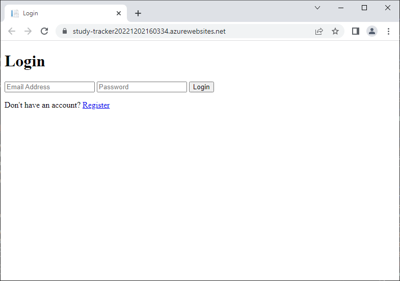
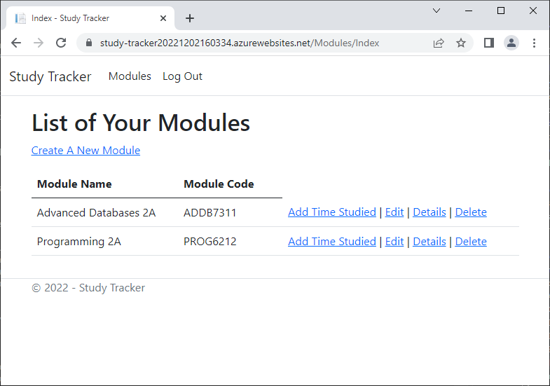
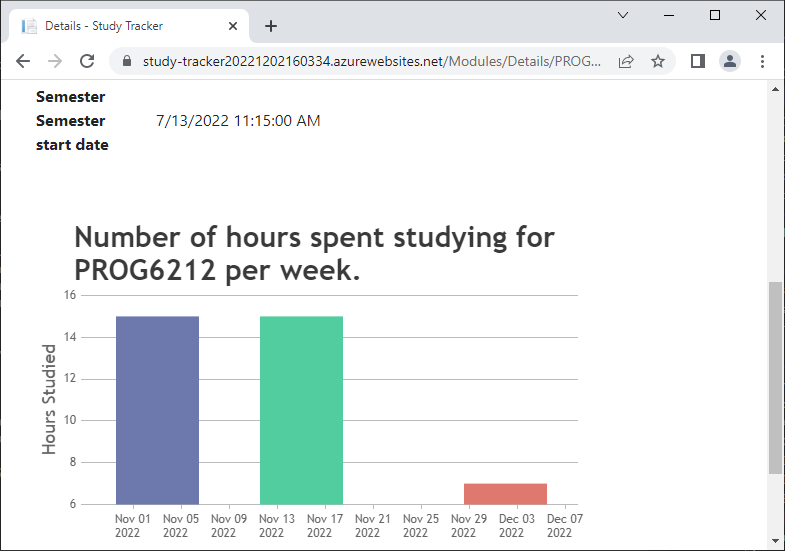
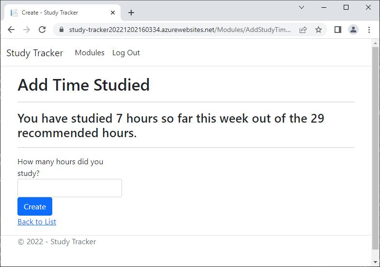

# Study Tracker

This program can help you keep track of how long you have studied for a module this year.
You can view how long you have studied for a particular module as well as get a recommendation on how long you should spend studying.
The program uses ASP.net core web application technology to allow you to access your data from anywhere.

## Steps to Install
1. Clone the repository.
2. Open the project in Visual Studio 2022.
3. Build the project, this will install the required dependancies from nuget.

**Optional
Run the pre-compiled binaries located in the /bin and /debug folders.

## How to Use
Navigate to the website at https://study-tracker20221202160334.azurewebsites.net and either make an account or login.

After a successful login you will be presented with a list of your modules.

If you do not have any, you can make one by selecting 'Create A New Module'.
After creating a new module, you will be able to view it on the modules page.
If you select the option 'Details' you will be redirected to page where you can see the modules' details as well a bar chart showing the dates that you have studied on.

On the modules page there are a number of actions you can perform on a module such as viewing it in more detail as described above, editing it or deleting it.
If you wish the add the time you have studied today press 'Add Time Studied'.
You will be taken to a window where you can enter the number of hours you have studied.
The recommended number of hours to study this week will be at the top of the page as well as on the 'Details' page.

## License
MIT License

Copyright (c) [2022] [Rial Seebran]

Permission is hereby granted, free of charge, to any person obtaining a copy
of this software and associated documentation files (the "Software"), to deal
in the Software without restriction, including without limitation the rights
to use, copy, modify, merge, publish, distribute, sublicense, and/or sell
copies of the Software, and to permit persons to whom the Software is
furnished to do so, subject to the following conditions:

The above copyright notice and this permission notice shall be included in all
copies or substantial portions of the Software.

THE SOFTWARE IS PROVIDED "AS IS", WITHOUT WARRANTY OF ANY KIND, EXPRESS OR
IMPLIED, INCLUDING BUT NOT LIMITED TO THE WARRANTIES OF MERCHANTABILITY,
FITNESS FOR A PARTICULAR PURPOSE AND NONINFRINGEMENT. IN NO EVENT SHALL THE
AUTHORS OR COPYRIGHT HOLDERS BE LIABLE FOR ANY CLAIM, DAMAGES OR OTHER
LIABILITY, WHETHER IN AN ACTION OF CONTRACT, TORT OR OTHERWISE, ARISING FROM,
OUT OF OR IN CONNECTION WITH THE SOFTWARE OR THE USE OR OTHER DEALINGS IN THE
SOFTWARE.